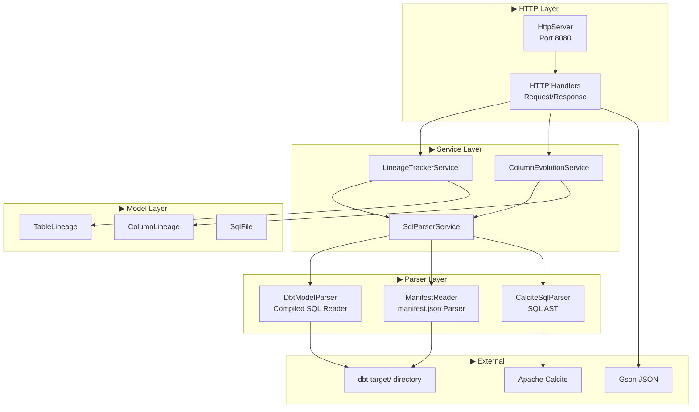
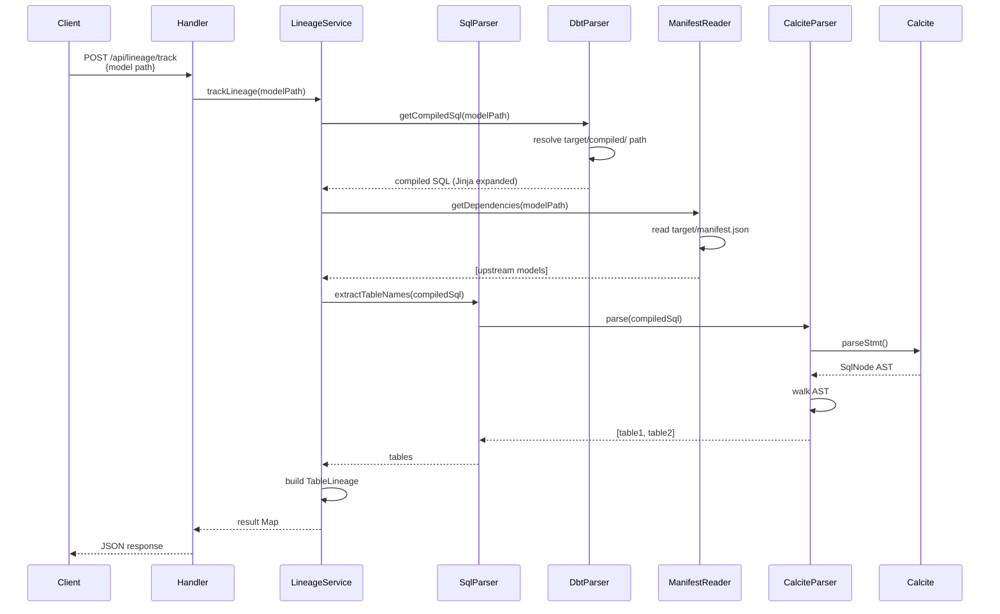
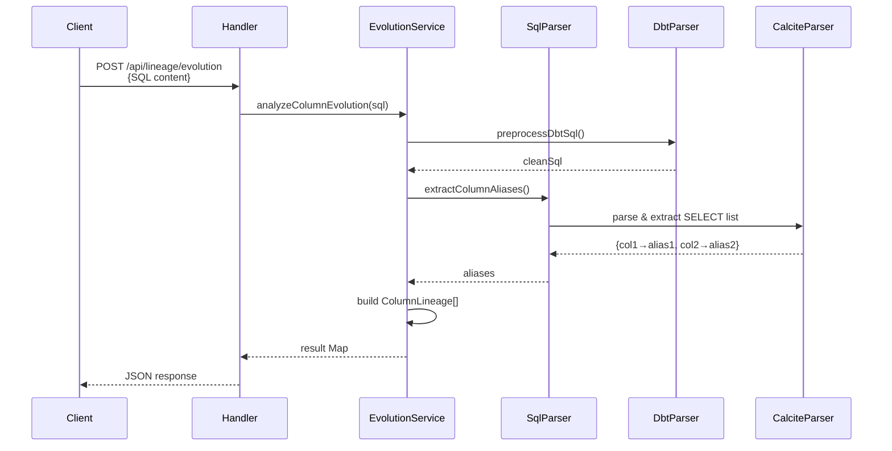
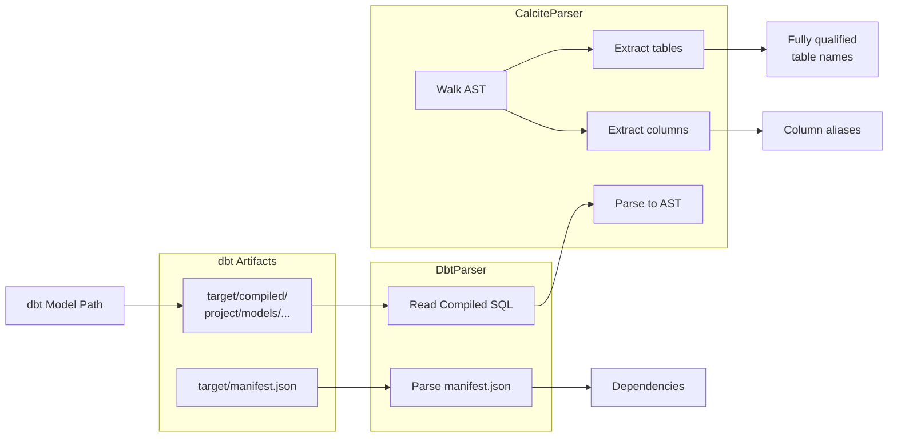
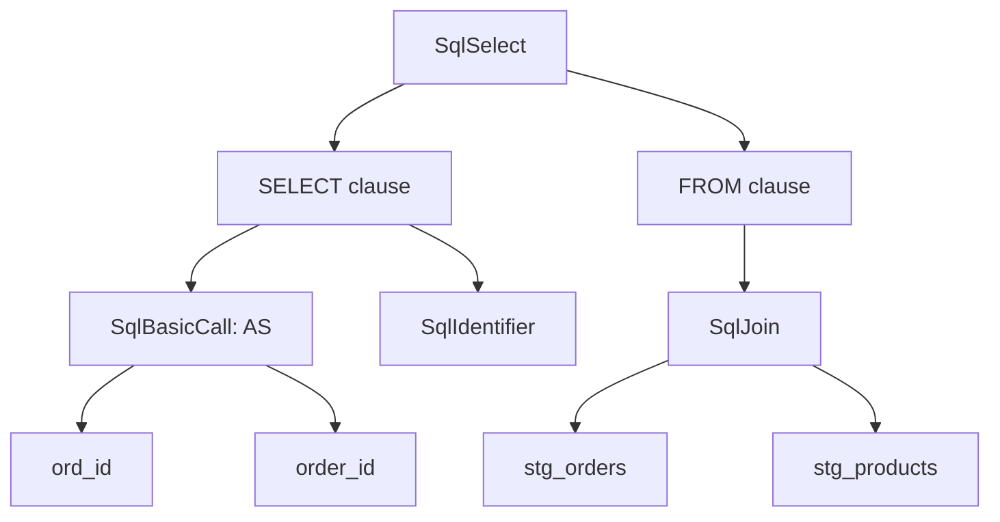
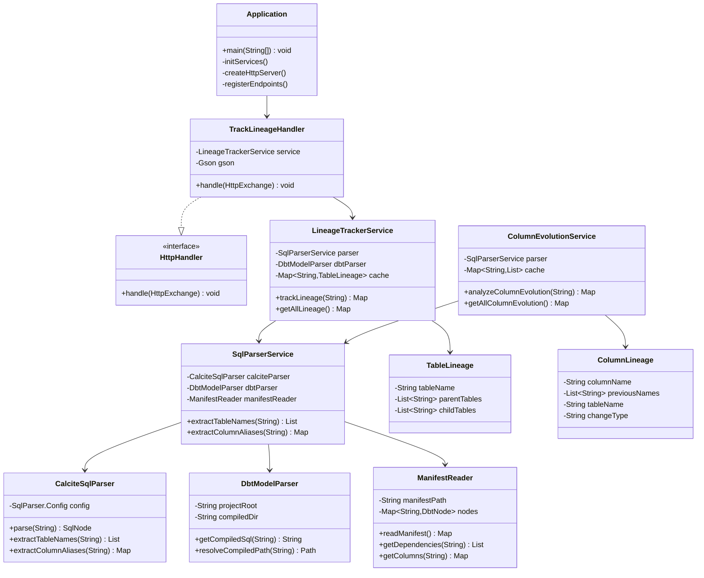
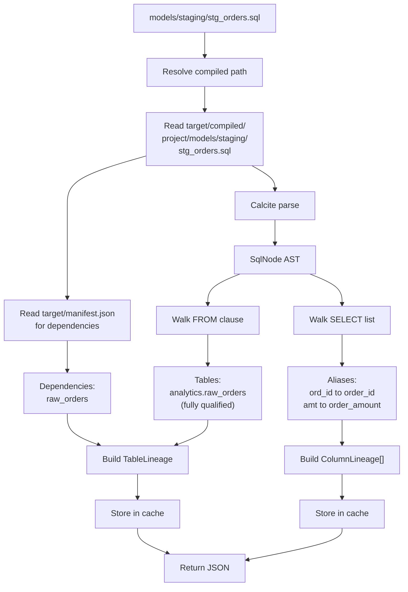
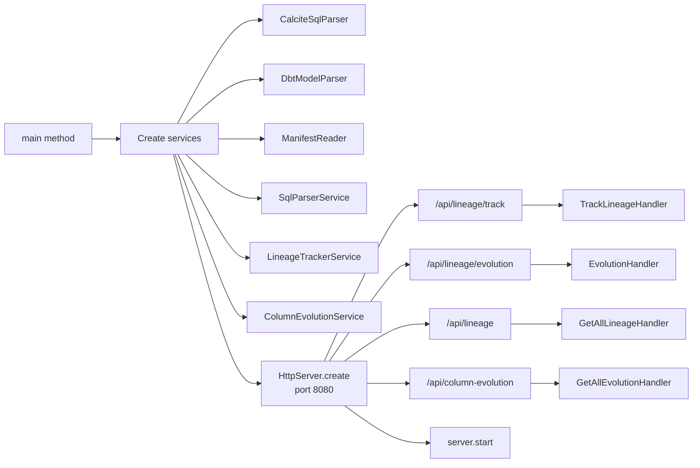
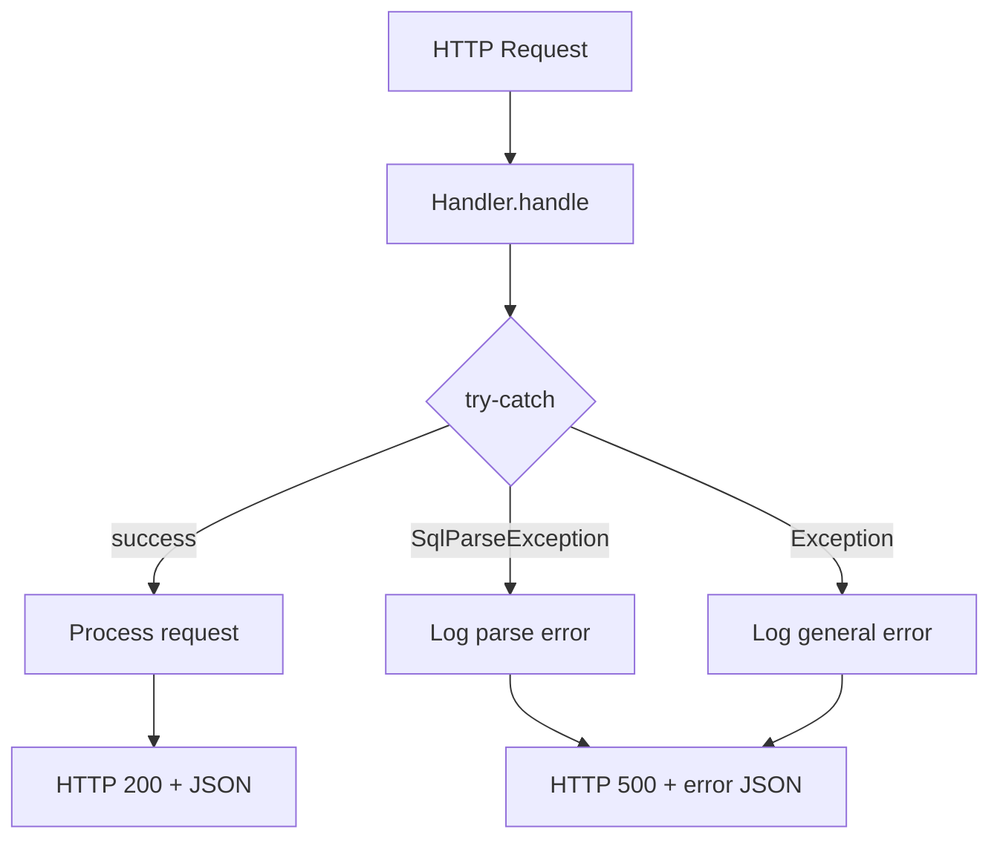

# SQL Lineage Tool - Architecture

A pure JDK-based backend for tracking SQL table lineage and column evolution in dbt projects.

**Assumes dbt is installed** - leverages compiled SQL and manifest.json for accurate lineage tracking.

## System Components



## Request Flow: Track Lineage



## Request Flow: Column Evolution



## Data Flow: dbt SQL Processing



## AST Walking Pattern



## Class Structure



## Example: Processing stg_orders.sql



## HTTP Server Setup



## API Endpoints

| Method | Endpoint | Request | Response |
|--------|----------|---------|----------|
| POST | `/api/lineage/track` | Model path (e.g., "models/staging/stg_orders.sql") | `{"sourceTables": [], "dependencies": [], "fullyQualifiedTables": [], ...}` |
| POST | `/api/lineage/evolution` | Model path | `{"columns": [{"columnName": "", "previousNames": [], ...}]}` |
| GET | `/api/lineage` | - | All cached lineage data |
| GET | `/api/column-evolution` | - | All cached column evolution data |

## Dependencies

**Core:**
- JDK 21 (HttpServer, standard library)

**External:**
- Apache Calcite 1.36.0 (SQL parsing)
- Gson 2.10.1 (JSON serialization)

**Assumes:**
- dbt installed in user environment
- Access to `target/compiled/` and `target/manifest.json` from dbt project

## Directory Structure

```
java-backend/
├── pom.xml
├── ARCHITECTURE.md
└── src/main/java/com/sqllineage/
    ├── Application.java              # Entry point, HTTP server setup
    ├── controller/
    │   └── LineageController.java    # HTTP handlers (HttpHandler implementations)
    ├── service/
    │   ├── SqlParserService.java          # Coordinates parsing
    │   ├── LineageTrackerService.java
    │   └── ColumnEvolutionService.java
    ├── parser/
    │   ├── CalciteSqlParser.java          # SQL AST parsing
    │   ├── DbtModelParser.java            # Read compiled SQL from target/
    │   └── ManifestReader.java            # Parse manifest.json
    ├── model/
    │   ├── TableLineage.java
    │   ├── ColumnLineage.java
    │   ├── DbtNode.java                   # manifest.json node representation
    │   └── SqlFile.java
    └── util/
        └── SqlUtils.java                  # AST walking utilities
```

## Design Patterns

**▶ Layered Architecture**
- HTTP Layer: Request handling, routing
- Service Layer: Business logic, caching
- Parser Layer: dbt artifacts + SQL AST processing
- Model Layer: Data structures

**▶ Manual Dependency Injection**
- Constructor-based dependency passing
- No framework annotations
- Explicit object lifecycle management

**▶ dbt Artifact Parsing**
1. DbtModelParser: Read compiled SQL from `target/compiled/`
2. ManifestReader: Parse `target/manifest.json` for lineage metadata
3. CalciteSqlParser: Parse fully-expanded SQL to AST

**▶ Visitor Pattern**
- Walk Calcite's SqlNode tree
- Extract tables from FROM clauses
- Extract aliases from SELECT lists

## Error Handling



## Build & Run

```bash
# Ensure dbt project is compiled first
cd /path/to/dbt-project
dbt compile

# Then build Java backend
cd java-backend
mvn clean compile

# Run (point to dbt project root)
mvn exec:java -Dexec.mainClass="com.sqllineage.Application" \
  -Dexec.args="/path/to/dbt-project"

# Package
mvn clean package
java -jar target/sql-lineage-backend-1.0.0-SNAPSHOT.jar /path/to/dbt-project
```

## Test Data

Sample dbt models in `test-data/` demonstrate:
- Jinja templating (`{{ ref() }}`, `{{ source() }}`)
- Column renaming (AS clauses)
- Multi-table joins
- Lineage across staging → intermediate → marts layers

**To use test data:**
```bash
# Compile test data as a dbt project
cd test-data
dbt compile

# Then run backend pointing to test-data
cd ../java-backend
mvn exec:java -Dexec.mainClass="com.sqllineage.Application" -Dexec.args="../test-data"
```

## Distribution Notes

**For VS Code Extension:** Bundle a minimal JRE (~50-100MB) inside the extension package to avoid requiring users to install Java. The extension can spawn the bundled Java runtime to start the HTTP server automatically on activation.

**Alternative:** Use GraalVM Native Image to compile to a platform-specific executable (no JRE needed), though this adds build complexity.
